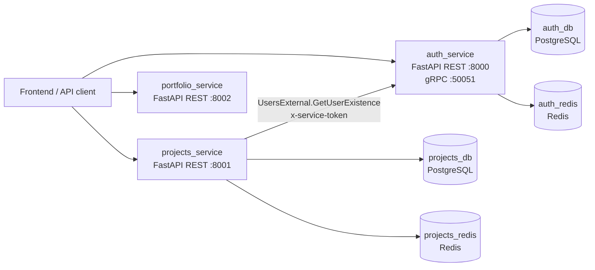

# MateForge

MateForge is a backend-first platform for creative collaboration: indie teams, authors, developers, artists, musicians and other makers can find projects, join teams, manage roles and build public profiles.

The frontend is not part of this repository yet. The current codebase is a microservice backend foundation for the MVP.

## Current Status

The repository contains three services:

| Service | Port | Status | Responsibility |
| --- | ---: | --- | --- |
| `auth_service` | `8000` | active | users, auth, profiles, followers, JWT, refresh sessions |
| `projects_service` | `8001` | active | projects, privacy, staff roles, invitations, join requests |
| `portfolio_service` | `8002` | skeleton | future user portfolio service, currently health check only |

Internal service communication:

| From | To | Protocol | Purpose |
| --- | --- | --- | --- |
| `projects_service` | `auth_service` | gRPC | verifies that a target user exists before invites/join-request decisions |
| API clients | services | HTTP/REST | public backend API |

## Architecture



Each active service follows a layered structure:

```text
service/
+-- migrations/              # Alembic migrations
+-- src/
|   +-- application/         # business use cases
|   +-- infrastructure/      # database, Redis, gRPC, security, repositories
|   +-- presentation/        # FastAPI routes, schemas, dependencies
+-- tests/                   # integration and unit tests
```

Design principles used in the backend:

- microservices are kept separate;
- HTTP layer stays thin and delegates to application services;
- database access is hidden behind repositories;
- external service calls go through explicit gateway/port abstractions;
- schema changes are represented by Alembic migrations;
- security-sensitive flows are covered by tests.

## Implemented Features

### Auth Service

- user registration;
- email verification token generation;
- login with JWT access token and refresh token;
- refresh-token hashing in Redis;
- atomic refresh rotation to prevent replay;
- logout for one session and all sessions;
- login rate limiting;
- user profile read/update/delete;
- public profile without private fields;
- follow/followers/following;
- gRPC endpoint for internal user existence checks.

### Projects Service

- create, read, update and delete projects;
- private/public project response shapes;
- project staff roles: `founder`, `admin`, `manager`, `participant`;
- founder invariants: founder role cannot be granted, changed or removed;
- invites to project;
- join requests;
- accept/reject flows for invites and requests;
- staff listing with membership checks;
- internal user verification through Auth gRPC gateway.

### Security Baseline

- JWT issuer/audience validation;
- strict JWT token type validation;
- access tokens and verification tokens have separate lifetimes;
- refresh tokens are never stored in Redis as raw values;
- refresh sessions are rotated atomically;
- gRPC service-to-service calls require `GRPC_SERVICE_TOKEN`;
- CORS is configured through `ALLOWED_ORIGINS`;
- basic security headers are added by middleware;
- containers run as a non-root user;
- Postgres and Redis ports are bound to `127.0.0.1` in local Docker Compose.

## Repository Layout

```text
mateforge/
+-- auth_service/
|   +-- migrations/
|   +-- src/
|   +-- tests/
+-- projects_service/
|   +-- migrations/
|   +-- src/
|   +-- tests/
+-- portfolio_service/
|   +-- src/
+-- protos/
|   +-- users.proto
+-- docker-compose.yml
+-- pyproject.toml
+-- .github/workflows/ci.yml
```

## Requirements

For Docker-based development:

- Docker Desktop;
- Docker Compose v2.

For local test runs outside containers:

- Python `3.12`;
- running local Postgres/Redis services from `docker-compose.yml`.

## Environment Setup

Create service env files from examples:

```powershell
Copy-Item auth_service\.env.example auth_service\.env
Copy-Item projects_service\.env.example projects_service\.env
```

On Linux/macOS:

```bash
cp auth_service/.env.example auth_service/.env
cp projects_service/.env.example projects_service/.env
```

Before starting the services, update these values:

- `JWT_SECRET` must be the same in `auth_service/.env` and `projects_service/.env`;
- `GRPC_SERVICE_TOKEN` must be the same in `auth_service/.env` and `projects_service/.env`;
- both values must be at least 32 characters long;
- mail settings in `auth_service/.env` must be replaced with real SMTP credentials if real email delivery is needed.

You can generate secrets with:

```bash
python -c "import secrets; print(secrets.token_urlsafe(48))"
```

Never commit real `.env` files or production secrets.

## Running With Docker Compose

Build and start all services:

```bash
docker compose up --build
```

The compose command automatically runs Alembic migrations for `auth_service` and `projects_service` before starting their HTTP apps.

Available local endpoints:

| Service | Health | OpenAPI |
| --- | --- | --- |
| Auth | `http://localhost:8000/health` | `http://localhost:8000/docs` |
| Projects | `http://localhost:8001/health` | `http://localhost:8001/docs` |
| Portfolio | `http://localhost:8002/health` | `http://localhost:8002/docs` |

Stop services:

```bash
docker compose down
```

Stop services and remove local database volumes:

```bash
docker compose down -v
```

## Running Tests Locally

Start only infrastructure containers:

```bash
docker compose up -d auth_db auth_redis projects_db projects_redis
```

Create test databases. If they already exist, the command can fail safely:

```bash
docker compose exec -T auth_db sh -c "createdb -U user test_db || true"
docker compose exec -T projects_db sh -c "createdb -U user test_db || true"
```

Create and activate a virtual environment:

```powershell
python -m venv .venv
.\.venv\Scripts\Activate.ps1
python -m pip install --upgrade pip
pip install -r auth_service\requirements.txt -r projects_service\requirements.txt
```

On Linux/macOS:

```bash
python -m venv .venv
source .venv/bin/activate
python -m pip install --upgrade pip
pip install -r auth_service/requirements.txt -r projects_service/requirements.txt
```

Run tests:

```bash
python -m pytest auth_service/tests -q
python -m pytest projects_service/tests -q
```

Run tests with coverage:

```bash
python -m pytest auth_service/tests --cov=auth_service.src --cov-config=.coveragerc --cov-report=term-missing -q
python -m pytest projects_service/tests --cov=projects_service.src --cov-config=.coveragerc --cov-report=term-missing -q
```

Current local baseline:

| Service | Tests | Coverage |
| --- | ---: | ---: |
| `auth_service` | `24 passed` | `88%` |
| `projects_service` | `29 passed` | `89%` |

## Linting

Run Ruff:

```bash
python -m ruff check .
```

Ruff settings live in `pyproject.toml`.

## Database Migrations

Each active service owns its own database and Alembic history.

Run migrations inside Docker:

```bash
docker compose exec auth_service python -m alembic upgrade head
docker compose exec projects_service python -m alembic upgrade head
```

Generate a new migration from inside a service directory:

```bash
cd auth_service
python -m alembic revision --autogenerate -m "describe_change"
```

```bash
cd projects_service
python -m alembic revision --autogenerate -m "describe_change"
```

Important rules:

- every model change must have a migration;
- tests validate expected database schema;
- migrations should not depend on importing application runtime state beyond model metadata.

## API Quick Start

Register a user:

```bash
curl -X POST http://localhost:8000/auth/register \
  -H "Content-Type: application/json" \
  -d '{"email":"alice@example.com","username":"alice","password":"Strong_password-33"}'
```

Login:

```bash
curl -X POST http://localhost:8000/auth/login \
  -H "Content-Type: application/x-www-form-urlencoded" \
  -H "X-Client-Fingerprint: local-device" \
  -d "username=alice@example.com&password=Strong_password-33"
```

Create a project:

```bash
curl -X POST http://localhost:8001/projects/ \
  -H "Authorization: Bearer <access_token>" \
  -H "Content-Type: application/json" \
  -d '{"name":"Indie Game Jam","about":"Small team for a story-driven game","is_private":false}'
```

Invite a user to a project:

```bash
curl -X POST "http://localhost:8001/projects/<project_id>/invite?target_user_id=<user_id>" \
  -H "Authorization: Bearer <access_token>"
```

## CI

GitHub Actions workflow is defined in `.github/workflows/ci.yml`.

It runs:

1. Python `3.12` setup;
2. Ruff linting;
3. service matrix for `auth_service` and `projects_service`;
4. Postgres and Redis service containers;
5. Alembic upgrade;
6. pytest with coverage report.

## Current Product Gaps

The backend foundation is solid, but the full MVP is not complete yet.

Known gaps:

- no frontend in this repository;
- no API gateway/BFF layer yet;
- `portfolio_service` is a skeleton;
- project search is not exposed as a finished API;
- project comments are not implemented;
- project subscriptions/publications exist in models but need complete API and business flows;
- no news feed yet;
- no production observability stack yet: structured logs aggregation, tracing, metrics, alerting;
- no deployment manifests for Kubernetes or managed cloud runtime.

## Development Guidelines

When adding new functionality:

- keep service boundaries explicit;
- avoid direct cross-service database access;
- use gRPC/HTTP gateways for inter-service communication;
- keep FastAPI routes thin;
- put business rules in `application` services;
- keep database logic in repositories;
- add or update Alembic migrations for schema changes;
- cover security-sensitive behavior with tests;
- keep secrets out of git.

## Useful URLs

After `docker compose up --build`:

- Auth docs: `http://localhost:8000/docs`
- Projects docs: `http://localhost:8001/docs`
- Portfolio docs: `http://localhost:8002/docs`
- Auth health: `http://localhost:8000/health`
- Projects health: `http://localhost:8001/health`
- Portfolio health: `http://localhost:8002/health`
